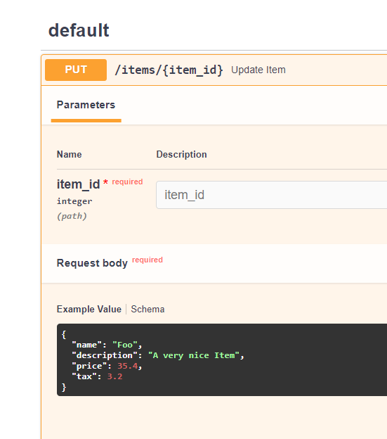
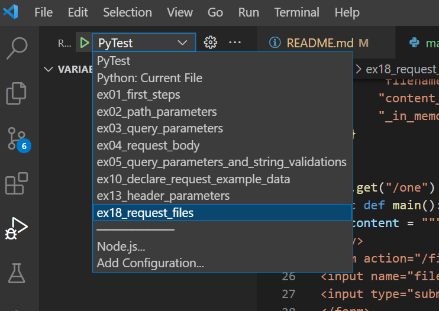
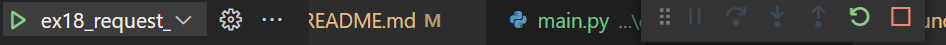
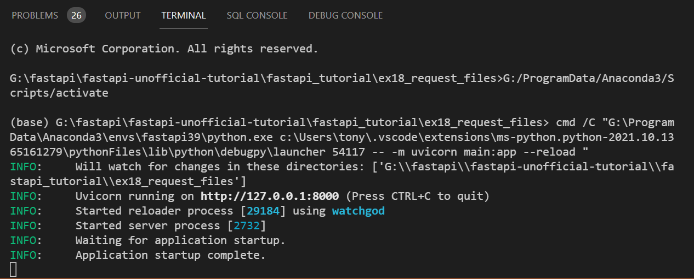
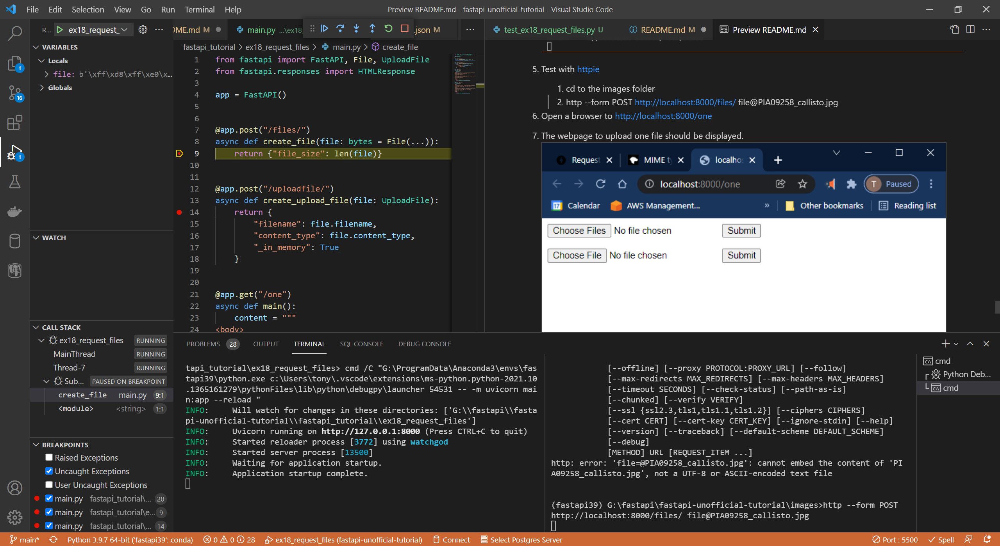
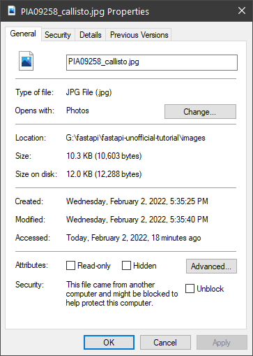
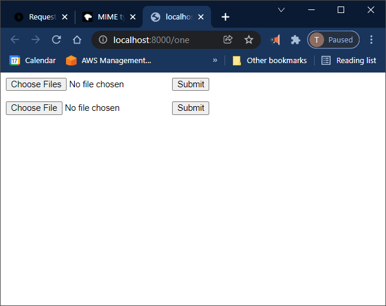
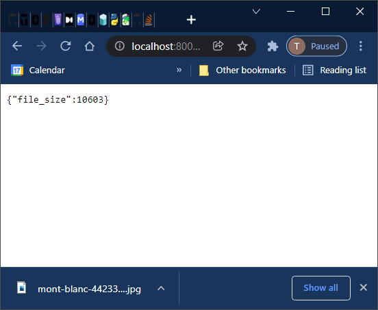
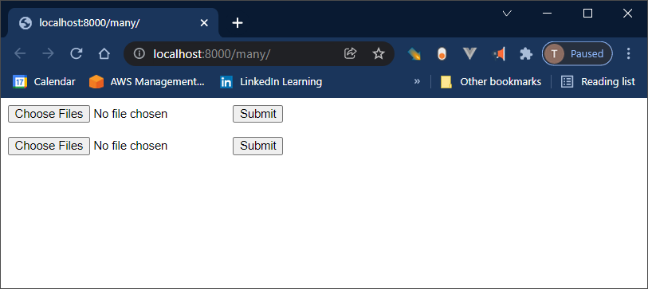

# fastapi un-official tutorial

## TL;DR

Need to learn FastAPI, well, fast? This repo shows you how to create unit tests for every tutorial example in the [Official FastAPI documentation](https://fastapi.tiangolo.com/).  The goal of this repo was two-fold, first to learn how to write REST API's in FastAPI and second, how to write unit tests for that REST API.  The third goal was to learn modern Python programming, which includes typing, Pydantic, async/await and Python 3.9 features.

## Preface

By Anthony Leotta

In this repo, I will work through the (Official FastAPI Tutorial](https://fastapi.tiangolo.com/tutorial/) by creating unit tests for each topic described.  I may stray from the Official Tutorial to satisfy my own curiosity.


<b>2/3/2022 Update:</b>

Sometimes is pays to read the source to a project. In the case of FastAPI, every example in the online documentation can be found in a folder named "docs_src", and the unit tests for then are in "tests\test_tutorial".  I learned alot from created my repo and creating all the unit test from scratch. After seeing the FastAPI tutorial code and pytest unit tests, I realized that using unit-tests as a learning tool really works.   I think looking at code is one thing, but understanding code enough to be able to write unit tests solidifies the concepts on a whole different level.  I am going to continue with this repo, even though I am basically doing the same thing that has already been done in FastAPI itself (and probably better).

## Setup

1. Install [httpie](https://httpie.io/)

    ```
    http --verison
    ```
1. Follow Tony's Tricks to [setup a fresh anaconda environments](https://github.com/datajango/Home#how-to-create-a-anaconda-python-environment) called fastapi39.

1. Activate Python Environment

    ```
    conda activate fastapi39
    ```

1. Install package dependencies.

    ```
    pip install -r requirements.txt
    ```

1. Test if uvicorn is installed correctly.

    ```
    uvicorn --version
    ```

1. If it is, you will see something like this, the version  number may vary:

    ```
    Running uvicorn 0.15.0 with CPython 3.9.7 on Windows
    ```

## Running the Tests using Pytest

1. Just run pytest, that's it.
    ```
    pytest -vv --disable-warnings
    ```

1. To run just the fastapi_tutorial tests

    ```
    pytest -vv --cov-report html  --cov=fastapi_tutorial
    ```

1. To generate a coverage report of all tutorials and playgrounds

    ```
    pytest -vv --cov-report html  --cov=fastapi_tutorial
    pytest -vv --cov-report html  --cov=pydantic_playground --cov-append
    pytest -vv --cov-report html  --cov=pytest_playground --cov-append
    pytest -vv --cov-report html  --cov=starlette_playground --cov-append
    pytest -vv --cov-report html  --cov=typing_playground --cov-append
    ```

1. Which results in a coverage report of all unit tests.


## Testing each server with httpie

1. [First Steps](https://fastapi.tiangolo.com/tutorial/first-steps/)
1. cd fastapi_tutorial
1. cd ex01_first_steps
1. uvicorn main:app --reload
1. use httpie to make a APi request
    ```
    http GET http://127.0.0.1:8000/
    ```
1. Which will return
    ```
    HTTP/1.1 200 OK
    content-length: 25
    content-type: application/json
    date: Fri, 28 Jan 2022 18:04:18 GMT
    server: uvicorn

    {
        "message": "Hello World"
    }
    ```
1. View [Interactive API docs]( http://127.0.0.1:8000/docs/)
1. View [Alternative Interactive API docs]( http://127.0.0.1:8000/redoc/)
1. View [OpenAPI Specification and JSON Schema](http://127.0.0.1:8000/openapi.json)

## Testing using VS Code Interactive Step Debugger

1. Add a debug launch configuration to .vscode\launch.json
    ```
    {
        "name": "ex01_first_steps",
        "type": "python",
        "request": "launch",
        "module": "uvicorn",
        "cwd": "${workspaceFolder}/fastapi_tutorial/ex01_first_steps",
        "args": [
            "main:app",
            "--reload"
        ],
        "jinja": true
    }
    ```

1. Test route @app.post()
    1. make a POST Request
        ```
        cat data.json | http POST http://127.0.0.1:8000/
        ```
    1. Which will return
        ```
        {
            "method": "POST",
            "request": {
                "email": "anthony@test.com",
                "name": "Anthony",
                "password": "123456"
            }
        }
        ```
1. Test route @app.put()
   1. make a PUT Request
        ```
        cat data.json | http PUT http://127.0.0.1:8000/
        ```
    1. Which will return
        ```
        {
            "method": "PUT",
            "request": {
                "email": "anthony@test.com",
                "name": "Anthony",
                "password": "123456"
            }
        }
        ```
1. Test route @app.delete()
    1. make a DELETE Request
        ```
        cat data.json | http DELETE http://127.0.0.1:8000/
        ```
    1. Which will return
        ```
        {
            "method": "DELETE",
            "request": {
                "email": "anthony@test.com",
                "name": "Anthony",
                "password": "123456"
            }
        }
        ```
1. Test route @app.options()
    1. make a OPTIONS Request
        ```
        http OPTIONS http://127.0.0.1:8000/
        ```
  1. Which will return
        ```
        {
            "method": "OPTIONS"
        }
        ```
1. Test route @app.head()
    1. make a HEAD Request
        ```
        http HEAD http://127.0.0.1:8000/
        ```
  1. Which will return
        ```
        {
            "method": "HEAD"
        }
        ```
1. Test route @app.patch()
    1. make a PATCH Request
        ```
        cat data.json | http PATCH http://127.0.0.1:8000/
        ```
    1. Which will return
        ```
        {
            "method": "PATCH",
            "request": {
                "email": "anthony@test.com",
                "name": "Anthony",
                "password": "123456"
            }
        }
        ```
1. Test route @app.trace()
    1. make a TRACE Request
        ```
        http TRACE http://127.0.0.1:8000/
        ```
    1. Which will return
        ```
        {
            "method": "TRACE"
        }
        ```

## ex02_path_parameters

1. [Path Parameters](https://fastapi.tiangolo.com/tutorial/path-params/)
1. Running the unit tests
    ```
    pytest -vv fastapi_tutorial\ex02_path_parameters\test_ex02_path_parameters.py
    ```

## ex03_query_parameters

1. [Query Parameters](https://fastapi.tiangolo.com/tutorial/query-params/)
1. Running the unit tests
    ```
    pytest -vv fastapi_tutorial\ex03_query_parameters\test_ex03_query_parameters.py
    ```

## ex04_request_body

1. [Request Body](https://fastapi.tiangolo.com/tutorial/body/)
1. Running the unit tests
    ```
    pytest -vv fastapi_tutorial\ex04_request_body\test_ex04_request_body.py
    ```

## ex05_query_parameters_and_string_validations

1. [Query Parameters and String Validations](https://fastapi.tiangolo.com/tutorial/query-params-str-validations/)
1. Running the unit tests
    ```
    pytest -vv fastapi_tutorial\ex05_query_parameters_and_string_validations\test_ex05_query_parameters_and_string_validations.py
    ```

## ex06_path_parameters_and_numeric_validations

1. [Path Parameters and Numeric Validations](https://fastapi.tiangolo.com/tutorial/path-params-numeric-validations/)
1. Running the unit tests
    ```
    pytest -vv fastapi_tutorial\ex06_path_parameters_and_numeric_validations\test_ex06_path_parameters_and_numeric_validations.py
    ```

## ex07_body_multiple_parameters

1. [Body - Multiple Parameters](https://fastapi.tiangolo.com/tutorial/body-multiple-params/)
1. Running the unit tests
    ```
    pytest -vv fastapi_tutorial\ex07_body_multiple_parameters\test_ex07_body_multiple_parameters.py
    ```

## ex08_body_fields

1. [Body - Fields](https://fastapi.tiangolo.com/tutorial/body-fields/)
1. Running the unit tests
    ```
    pytest -vv fastapi_tutorial\ex08_body_fields\test_ex08_body_fields.py
    ```

## ex09_body_nested_models

1. [Body - Nested Models](https://fastapi.tiangolo.com/tutorial/body-nested-models/)
1. Running the unit tests
    ```
    pytest -vv fastapi_tutorial\ex09_body_nested_models\test_ex09_body_nested_models.py
    ```

## ex10_declare_request_example_data

1. [Declare Request Example Data](https://fastapi.tiangolo.com/tutorial/schema-extra-example/)
1. There are no unit test for this section
1. run server
1. visit [Docs](http://127.0.0.1:8000/docs#/)



## ex11_extra_data_types

1. [Extra Data Types](https://fastapi.tiangolo.com/tutorial/extra-data-types/)
1. This is a deceptively deep section.  FastAPI's abilities to use different datatypes relieve just how much the Python language itself is in flux.  The differences between Python 3.5 to Python 3.11 are different enough to force the FastAPI documentation to include in some cases three versions of the same FastAPi code.

1. I am going with Python 3.6 and 3.9.  Python 3.10 and 3.11 seem stable enough but I cab only fight some many battles at once.
I will upgrade this repro to Python 3.11 or 3.12 when the time seems rights.

1. [Extra Data Types](https://fastapi.tiangolo.com/tutorial/extra-data-types/)

1. Running the unit tests

    ```
    pytest -vv fastapi_tutorial\ex11_extra_data_types\test_ex11_extra_data_types.py
    ```

## ex12_cookie_parameters

1. [Cookie Parameters](https://fastapi.tiangolo.com/tutorial/cookie-params/)
1. Running the unit tests
    ```
    pytest -vv fastapi_tutorial\ex12_cookie_parameters\test_ex12_cookie_parameters.py
    ```

## ex13_header_parameters

1. [Header Parameters](https://fastapi.tiangolo.com/tutorial/header-params/)
1. Running the unit tests
    ```
    pytest -vv fastapi_tutorial\ex13_header_parameters\test_ex13_header_parameters.py
    ```

1. Since the TestClient does not allow for duplicate headers to be sent, I will test using httpie.

    ```
    http GET http://127.0.0.1:8000/items2/ X-Token:foo
    ```

1. Returns

    ```
    HTTP/1.1 200 OK
    content-length: 26
    content-type: application/json
    date: Wed, 02 Feb 2022 14:43:43 GMT
    server: uvicorn

    {
        "X-Token values": [
            "foo"
        ]
    }
    ```

1. Sendc duplicate header
    ```
    http GET http://127.0.0.1:8000/items2/ X-Token:foo X-Token:bar
    ```

1. Returns
    ```
    HTTP/1.1 200 OK
    content-length: 32
    content-type: application/json
    date: Wed, 02 Feb 2022 14:44:57 GMT
    server: uvicorn

    {
        "X-Token values": [
            "foo",
            "bar"
        ]
    }
    ```

1. To fix this bug the fastapi39\Lib\site-packages\requests\models.py lines 446 to 455 need to look for either a dictionary or a list, because dictionaries do not allow duplicate keys.

    ```
    def prepare_headers(self, headers):
        """Prepares the given HTTP headers."""

        self.headers = CaseInsensitiveDict()
        if headers:
            for header in headers.items():
                # Raise exception on invalid header value.
                check_header_validity(header)
                name, value = header
                self.headers[to_native_string(name)] = value
    ```

## ex14_response_model

1. [Response Model](https://fastapi.tiangolo.com/tutorial/response-model/)
1. Running the unit tests
    ```
    pytest -vv fastapi_tutorial\ex14_response_model\test_ex14_response_model.py
    ```

## ex15_extra_models

1. [Extra Models](https://fastapi.tiangolo.com/tutorial/extra-models/)
1. Running the unit tests
    ```
    pytest -vv fastapi_tutorial\ex15_extra_models\test_ex15_extra_models.py
    ```

## ex16_response_status_code

1. [Response Status Code](https://fastapi.tiangolo.com/tutorial/response-status-code/)
1. Running the unit tests
    ```
    pytest -vv fastapi_tutorial\ex16_response_status_code\test_ex16_response_status_codes.py
    ```

## ex17_form_data

1. [Form Data](https://fastapi.tiangolo.com/tutorial/request-forms/)
1. Running the unit tests
    ```
    pytest -vv fastapi_tutorial\ex17_form_data\test_ex17_form_data.py
    ```

## ex18_request_files

1. [Request Files](https://fastapi.tiangolo.com/tutorial/request-files/)
1. To run unit tests.
    ```
    pytest -vv fastapi_tutorial\ex18_request_files\test_ex18_request_files.py
    ```
1. [MIME Types](https://developer.mozilla.org/en-US/docs/Web/HTTP/Basics_of_HTTP/MIME_types)

### Test Upload One File at a Time

1. Pick the ex18_request_files launch target from the VS Code Debug Launch drop-down

1. The launch configuration is shown below:
    ```
    {
        "name": "ex18_request_files",
        "type": "python",
        "request": "launch",
        "module": "uvicorn",
        "cwd": "${workspaceFolder}/fastapi_tutorial/ex18_request_files",
        "args": ["main:app", "--reload"],
        "jinja": true
    }
    ```
1. Click the green triangle launch button

1. The FastAPI server should start up and messages will appear in the terminal.

1. Test with [httpie](https://httpie.io/)
    1. cd to the images folder
    1. http --form POST http://localhost:8000/files/ file@PIA09258_callisto.jpg
    1. I set a break point on line 9 of
    
    1. The response was
    ```
    HTTP/1.1 200 OK
    content-length: 19
    content-type: application/json
    date: Wed, 02 Feb 2022 22:49:47 GMT
    server: uvicorn

    {
        "file_size": 10603
    }
    ```
    1. This matches the file size.
    
    1. It worked!
1. Test with a web browser
    `. Open a browser to [http://localhost:8000/one](http://localhost:8000/one)
    1. The webpage to upload one file should be displayed.
    
    1. I have downloaded some public domain images from [publicdomainreview.org](https://publicdomainreview.org/collection/mont-blanc-ascent) in a folder names "images", select one of those or your own file to upload.
    Also some NASA images from [NASA](https://photojournal.jpl.nasa.gov/catalog/PIA00600) are there.
    1. upload a file
    
    1. It works!
    

### Upload Multiple Files
1. Test with [httpie](https://httpie.io/)
    1. cd to the images folder
    1. http --form POST http://localhost:8000/files/many/ files@PIA09258_callisto.jpg files@PIA00600_modest.jpg
    1. I set a break point on line 9 of
    
    1. The response was
        ```
        HTTP/1.1 200 OK
        content-length: 28
        content-type: application/json
        date: Thu, 03 Feb 2022 01:53:54 GMT
        server: uvicorn

        {
            "file_sizes": [
                10603,
                31793
            ]
        }
        ```
    1. It worked!

1. Test with a web browser
    1. Open a browser to [http://localhost:8000/many/](http://localhost:8000/many/)
    1. The webpage to upload one file should be displayed.
    
    1. Select files to be uploaded
    1. It works!
        ```
        {"file_sizes":[60080,59073,57081,48237]}
        ```

## ex19_request_forms_and_files

1. [Request Forms and Files](https://fastapi.tiangolo.com/tutorial/request-forms-and-files/)

1. To run unit tests.
    ```
    pytest -vv fastapi_tutorial\ex19_request_forms_and_files\test_ex19_request_forms_and_files.py
    ```

## ex20_handling_errors

1. [Handling Errors](https://fastapi.tiangolo.com/tutorial/handling-errors/)

1. To run unit tests.
    ```
    pytest -vv fastapi_tutorial\ex20_handling_errors\test_ex20_handling_errors.py
    pytest -vv fastapi_tutorial\ex20_handling_errors\test_ex20_handling_errors_plain_exception.py
    ```

## ex21_path_operation_configuration

1. [Path Operation Configuration](https://fastapi.tiangolo.com/tutorial/path-operation-configuration/)

1. To run unit tests.
    ```
    pytest -vv fastapi_tutorial\ex21_path_operation_configuration\test_ex21_path_operation_configuration.py
    ```
1. To view API docs
    1. Start server
        1. I use a VS Code Launch Configuration named: ex21_path_operation_configuration
    1. View [Interactive API docs]( http://127.0.0.1:8000/docs/)
    1. View [Alternative Interactive API docs]( http://127.0.0.1:8000/redoc/)
    1. View [OpenAPI Specification and JSON Schema](http://127.0.0.1:8000/openapi.json)

## ex22_json_compatible_encoder

1. [JSON Compatible Encoder](https://fastapi.tiangolo.com/tutorial/encoder/)

1. To run unit tests.
    ```
    pytest -vv fastapi_tutorial\ex22_json_compatible_encoder\test_ex22_json_compatible_encoder.py
    ```

## ex23_body_updates

1. [Body - Updates](https://fastapi.tiangolo.com/tutorial/body-updates/)

1. To run unit tests.
    ```
    pytest -vv fastapi_tutorial\ex23_body_updates\test_ex23_body_updates.py
    ```

## ex26_middleware

1. [Middleware](https://fastapi.tiangolo.com/tutorial/middleware/)

1. To run unit tests.
    ```
    pytest -vv fastapi_tutorial\ex26_middleware\test_ex26_middleware.py
    ```

## ex27_cors

1. [CORS (Cross-Origin Resource Sharing)](https://fastapi.tiangolo.com/tutorial/cors/)

1. To run unit tests.
    ```
    pytest -vv fastapi_tutorial\ex27_cors\test_ex27_cors.py
    ```

## ex28_sql_databases

1. [SQL (Relational) Databases](https://fastapi.tiangolo.com/tutorial/sql-databases/)

1. To run unit tests.
    ```
    pytest -vv fastapi_tutorial\ex28_sql_databases\test_ex28_sql_databases.py
    ```

## ex29_bigger_applications_multiple_files

1. coming soon

## ex30_background_tasks

1. coming soon

## ex31_metadata_and_docs_urls

1. coming soon

## ex32_static_files

1. coming soon

## ex33_testing

1. coming soon

## ex34_debugging

1. coming soon

## ex35_advanced_user_guide_intro

1. coming soon

## ex36_advanced_path_operation_advanced_configuration

1. coming soon

## ex37_advanced_additional_status_codes

1. coming soon

## ex38_advanced_return_a_response_directly

1. coming soon

## ex39_advanced_custom_response_html_stream_file_others

1. coming soon

## ex40_additional_responses_in_openapi

1. coming soon

## ex41_advanced_response_cookies

1. coming soon

## ex42_advanced_response_headers

1. coming soon

## ex43_advanced_response_change_status_code

1. coming soon

## ex44_advanced_advanced_dependencies

1. coming soon

## ex45_advanced_security

1. coming soon

## ex46_advanced_using_the_request_directly

1. coming soon

## ex47_advanced_using_dataclasses

1. coming soon

## ex48_advanced_middleware

1. coming soon

## ex49_advanced_sql_relational_databases_with_peewee

1. coming soon

## ex50_advanced_async_sql_relational_databases

1. coming soon

## ex51_advanced_nosql_distributed__big_data_databases

1. coming soon

## ex52_advanced_sub_applications_mounts

1. coming soon

## ex53_advanced_behind_a_proxy

1. coming soon

## ex54_advanced_templates

1. coming soon

## ex55_advanced_graphql

1. coming soon

## ex56_advanced_websockets

1. coming soon

## ex57_advanced_events_startup_shutdown

1. coming soon

## ex58_advanced_custom_request_and_apiroute_class

1. coming soon

## ex59_advanced_testing_websockets

1. coming soon

## ex61_advanced_testing_dependencies_with_overrides

1. coming soon

## ex62_advanced_testing_a_database

1. coming soon

## ex63_advanced_async_tests

1. coming soon

## ex64_advanced_settings_and_environment_variables

1. coming soon

## ex65_advanced_conditional_openapi

1. coming soon

## ex66_advanced_extending_openapi

1. coming soon

## ex67_advanced_openapi_callbacks

1. coming soon

## ex68_advanced_including_wsgi_flask_django_others

1. coming soon

## ex69_concurrency_and_async_await

1. coming soon

## Resources

<DL>
<DT><A HREF="https://testdriven.io/blog/fastapi-graphql/" ADD_DATE="1610179108">Developing an API with FastAPI and GraphQL | TestDriven.io</A>

<DT><A HREF="https://github.com/koxudaxi/fastapi-code-generator" ADD_DATE="1620868618" ICON="data:image/png;base64,iVBORw0KGgoAAAANSUhEUgAAABAAAAAQCAYAAAAf8/9hAAACrElEQVQ4jW2SzWucVRTGf+fe9847SW2n+WioIdZkJkzGWLMsQvBjpRv1H1BcqSB166aUbgQXLkpEEGnF7ty5Edw0orULtS5DjNOZ5qvEKkMzEUuS6bz33tPFvCNj6LM653LO8/A85wpHUJmbW0QKbwMvAU8BCHpXkZshhK+2mmu3BudloC5UagsfI7wvIsOooqoKID2gqvuqfLFeX7kAdPsEBmZdea74beLcKxoj+R4iPf7BXozBZ9n1jdudN+BOZgEtV5/8pJAW3/JZ90ZU/UiF0yAnVbWpUVvAMLASo7+oUYuFQvrqiRFT2NttLctUtXouleIN62whZNm19dur7wLFiZmzpdbmahvQyWr15L2Dg312dg5n5s5+6lzhvPfZQ59lLyapce+IkSGNkSjaASzQaW2udvrh3Gs07ud2LUqmMVhrzLA4+55RNS+IqsYYO91u+AwIvVz+F3C/DkEffh5i3FdFwSwaEaYUBKT950Z9Ox+MgA4QaL+/22xuCWzl708bwGkv6mMj5XLxiPJRCJOTRYXx3pw6A9wRVRUjpZIZej5Xso+xkAB65lhp0YhM5H9k3ajqrxgD8MAm5sp0tVrLczhqwZ+ZfXbeJckSoGJEUH42MYQvUZXgw5Kq3nRu+I/KMwvLM9X5c/3tqXLtuUpt4WuXyC+CzANRo4audq/Yf9r3d0pjp0atTT7M/OGbxpg9VE5nofPNv+32HsDQ+MgTqXVXRSRV5dAmNo3eL2036tekf7JKbeEngbEY/QcKDzYba7/9Z2B6ulhJj2+LkQljLD5k1zfq8XVY8yY/WVivr7wcNf5oE/e9Mcmt0dnZE/398TR1COMi4n3wlzfqq6/BWheIdiCouLfb+u742KllVP/+q+l/gHYAONgdkdHRxIbgL202fr+aiwLwCG7VPT6fvRxuAAAAAElFTkSuQmCC">GitHub - koxudaxi/fastapi-code-generator: This code generator creates FastAPI app from an openapi file.</A>
</DL>